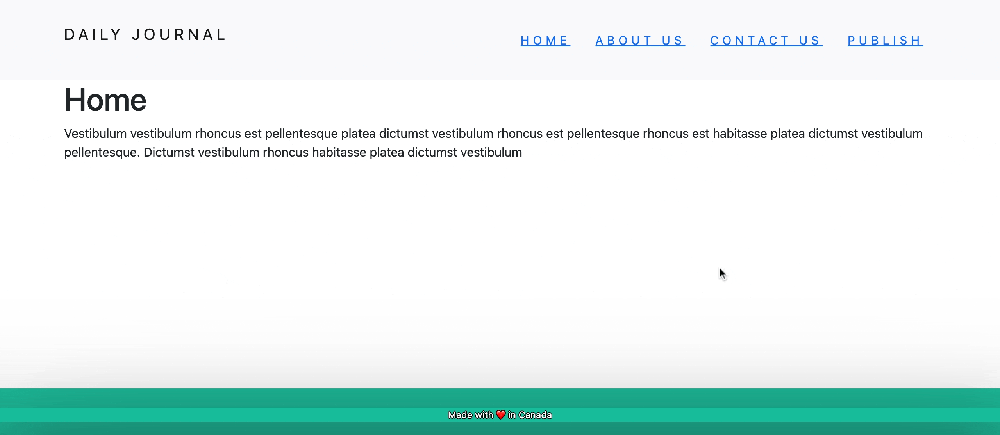

# Daily-Journal
A simple blog built using 
- HTML 
- CSS
- JS
- NodeJS
- EJS
- ExpressJS
- MongoDB
- Mongoose
- Bootsrap

It's a simple blogging web application where one can add new blog posts, view them in their own dedicated route, edit them, and delete them. The posts are stored in a local MongoDB database. EJS templating is used for the HTML pages, Bootstrap is also used, along with some custom CSS styling.

